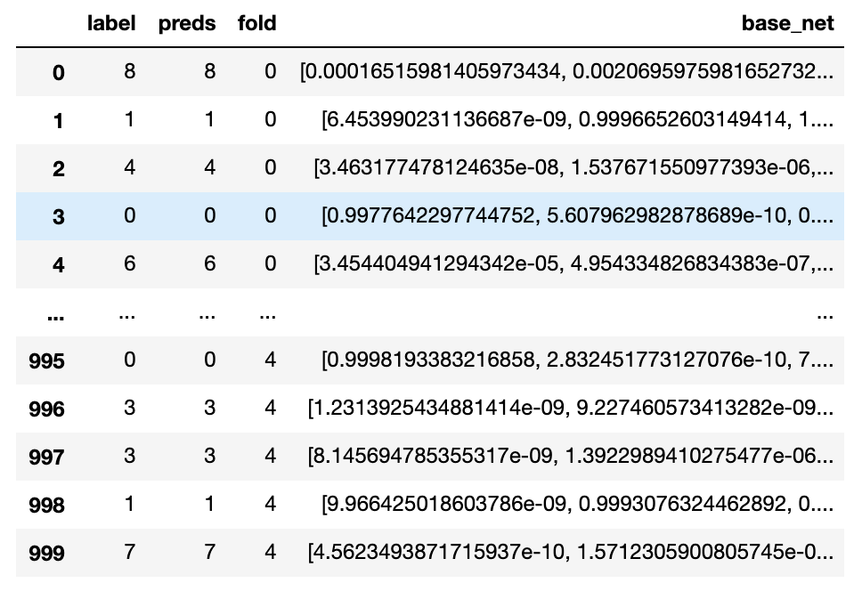

# Tantum

## Library with pipeline for Kaggle competitions
Supports GPU and TPU 

## Base Pipeline
### Params

```
class CFG:
    seed=42
    criterion = 'CrossEntropyLoss' 
    n_epochs = 10
    device= 'GPU'
    fmix=False 
    cutmix=False
    lr = 0.001
    swa = False
    nprocs = 1
    swa_start = 5
    print_freq = 100
    scheduler = 'GradualWarmupSchedulerV2'
    optimizer = Adam
    batch_size = 100
    weight_decay=1e-6
    gradient_accumulation_steps=1
    max_grad_norm=1000
    n_fold=5
    target_col = 'label'
    trn_fold=[0,1,2,3,4] #[0, 1, 2, 3, 4]
    num_workers = 0
    freeze_epo = 0 # GradualWarmupSchedulerV2
    warmup_epo = 1 # GradualWarmupSchedulerV2
    cosine_epo = 9 # GradualWarmupSchedulerV2  ## 19
    OUTPUT_DIR = './'
    model_name = 'simple_net'
    optimizer_params = dict(
        lr=lr, 
        weight_decay=weight_decay, 
        amsgrad=False
    )
```
## Mean Teacher Pipeline
### Params
```
class CFG:
    seed=42
    weight_mean_teacher = 0.2
    alpha_mean_teacher = 0.99
    criterion = 'CrossEntropyLoss' 
    n_epochs = 10
    device= 'GPU'
    fmix=False 
    cutmix=False
    lr = 0.001
    swa = False
    nprocs = 1
    swa_start = 5
    print_freq = 100
    scheduler = 'GradualWarmupSchedulerV2'
    optimizer = Adam
    batch_size = 100
    weight_decay=1e-6
    gradient_accumulation_steps=1
    max_grad_norm=1000
    n_fold=5
    target_col = 'label'
    trn_fold=[0,1,2,3,4] #[0, 1, 2, 3, 4]
    num_workers = 0
    freeze_epo = 0 # GradualWarmupSchedulerV2
    warmup_epo = 1 # GradualWarmupSchedulerV2
    cosine_epo = 9 # GradualWarmupSchedulerV2  ## 19
    OUTPUT_DIR = './'
    model_name = 'simple_net'
    optimizer_params = dict(
        lr=lr, 
        weight_decay=weight_decay, 
        amsgrad=False
    )
```

## Features supported
 - Learning Rate Warmup

Use in CFG:
```
    freeze_epo = 0 # GradualWarmupSchedulerV2
    warmup_epo = 1 # GradualWarmupSchedulerV2
    cosine_epo = 9 # GradualWarmupSchedulerV2  ## 19
```
- Label Smoothing

Use in CFG 
```
    criterion = 'LabelSmoothing' 
```
- CutMix and FMix

Use in CFG
```
    fmix=True 
    cutmix=True
```
- Gradient Accumulation

Use in CFG
```
    gradient_accumulation_steps = 1
```

- RAdam Optimizer

Use from tantum.optimizer
```
    from tantum.optimizer import RAdam
```

## Out Of Fold and Best Ensemble
After every train you will get the oof_df.csv file with 
predictions, folds, labels. 

```
class_columns = ['']
df['base_net'] = df[[class_columns]].apply(lambda r: tuple(r), axis=1).apply(np.array)
```



## Investigate

### Finding Final Ensembles
https://www.kaggle.com/jannish/cassava-leaf-disease-finding-final-ensembles

### Attention
https://github.com/TomYanabe/Cassava-Leaf-Disease-Classification/blob/master/src/modules.py
https://github.com/ZhenxingZheng/attention-network
https://www.kaggle.com/c/cassava-leaf-disease-classification/discussion/220751

### EMA Models
https://github.com/fadel/pytorch_ema

https://github.com/freedom1810/kaggle-cassava


## TODO

- [x] Base fitter with GPU
- [ ] Base fitter with TPU
- [x] Mean Teacher with GPU
- [ ] Mean Teacher with TPU
- [x] Mixed Precision Training
- [x] Cutmix, Fmix
- [ ] MixUp
- [ ] Callbacks inside trainig loop
- [ ] MixMatch
- [ ] FixMatch
- [ ] Out Of Fold csv with predictions and probs
- [ ] EMA model
- [ ] Finding Ensembles 
- [ ] Attention VIT
- [ ] Attntion Effnet (CBAM)
- [ ] Generic Ensemble class 
